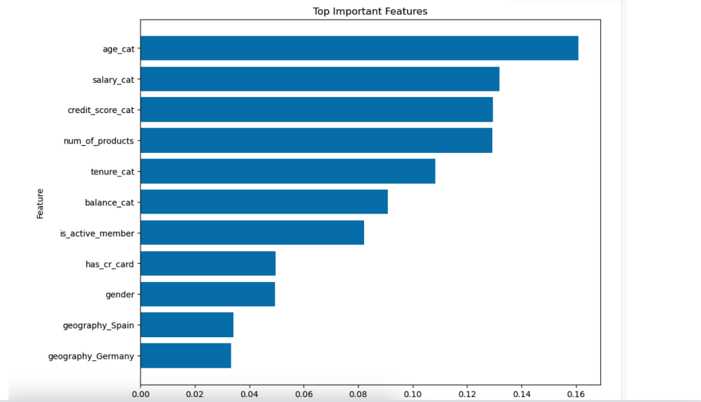
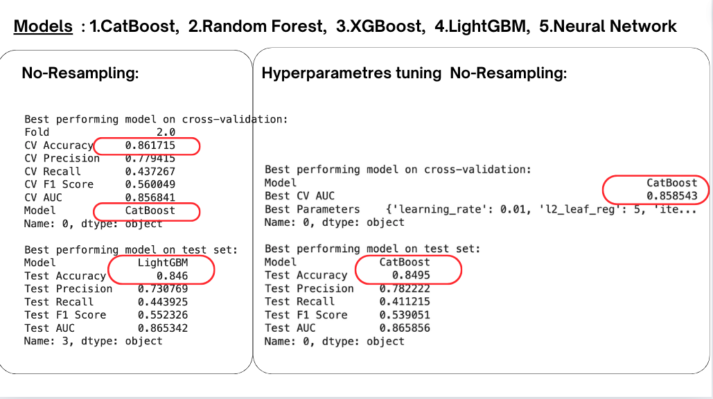
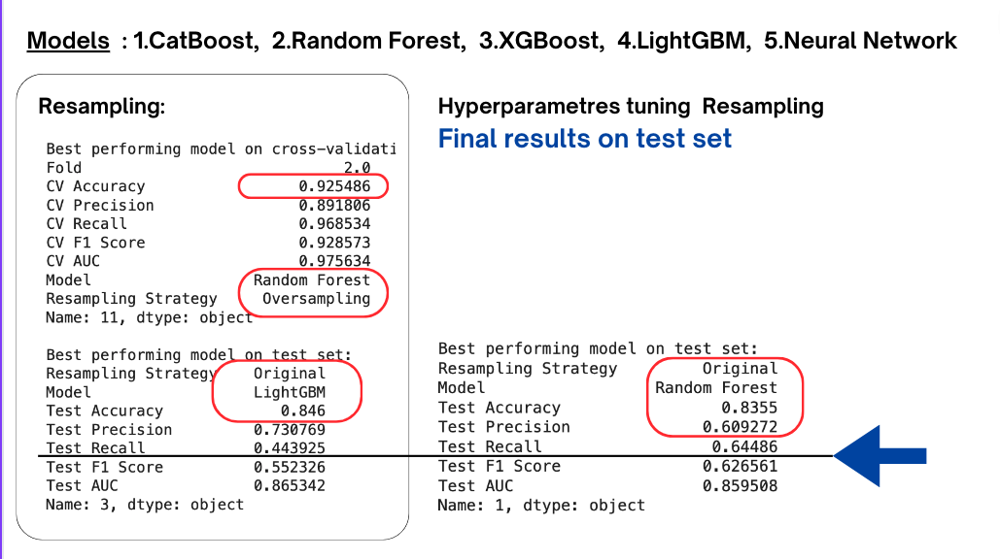
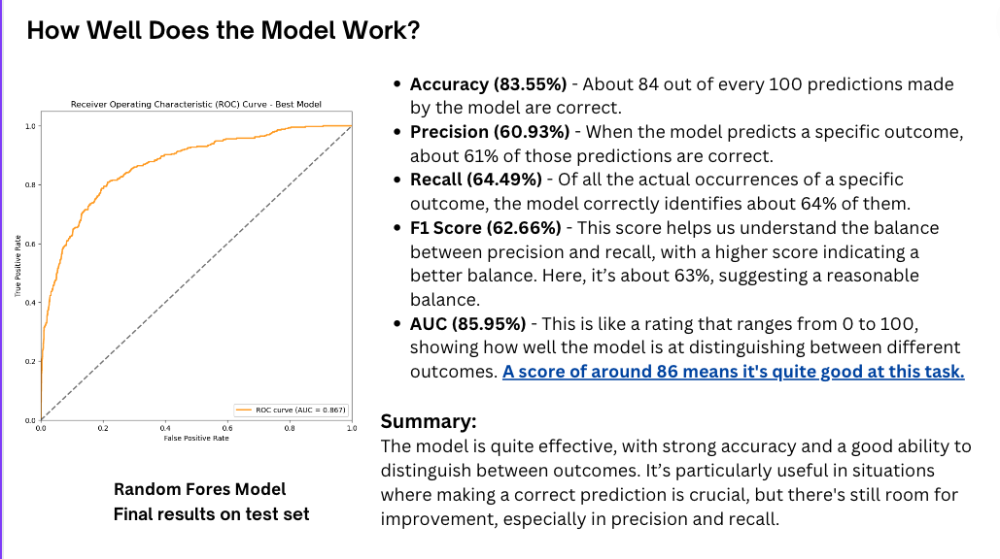

## Bank Churn Prediction: 97% Accuracy
### Machine Learning Project

### Situation
The primary goal of this project is to develop a predictive model that accurately identifies customers at risk of churning. The current churn rate is **20.4%**.

### Task
This project aims to analyze the factors contributing to customer churn, enabling the bank to implement strategies that enhance customer retention, thereby improving profitability and customer satisfaction.

### Action
- **Data Cleaning**: Ensuring the data is accurate and ready for analysis.
- **Univariate Analysis**: Examining individual variables for insights.
- **Bivariate Analysis**: Exploring the relationships between pairs of variables.
- **Feature Engineering**: Crafting and selecting relevant features for the model.
- **Model Building and Evaluation**: Constructing and assessing the performance of the machine learning models.

### Insights
- **Geography**: France has the largest customer base (50%), with Germany and Spain equally represented (25% each).
- **Gender**: The customer base is slightly male-dominated (55% male, 45% female).
- **Tenure**: Spread evenly across the first nine years, with fewer customers at 10 years (5%) and new customers (4%).
- **Number of Products**: Most customers use 1 or 2 products (96%), with very few using 3 or 4 products (4%).
- **Has Credit Card**: The majority of customers (71%) have a credit card.
- **Is Active Member**: The customer base is evenly split between active (51%) and inactive (49%) members.
- **Balance**: At least 25% of the customers have a zero balance.
- **Estimated Salary**: The distribution is fairly symmetrical around the mean of 100,099.29 and median of 100,218.00.
- **Age**: Minimum of 18 and maximum of 92 with a mean around 39 years.

### Customers' Characteristics Most Strongly Correlated with Churn

### Machine Learning Models Used
- CatBoost
- Random Forest
- XGBoost
- LightGBM
- Neural Network

### Hyperparameters Tuning and its Impact on Recall

### Business Impact
The developed predictive model features high accuracy and effectiveness in distinguishing between outcomes, crucial for precise predictions. This enables the bank to predict customer churn proactively and tailor retention efforts accordingly.

### Presentation Links
- **Streamlit**: [Bank Churn Prediction App](https://bankchurnapp.streamlit.app/)
- **Canva**: [Presentation Canvas](https://www.canva.com/design/DAGOlCxSgZQ/mv6fpD_kBsNDPibDl-attw/edit?utm_content=DAGOlCxSgZQ&utm_campaign=designshare&utm_medium=link2&utm_source=sharebutton)
